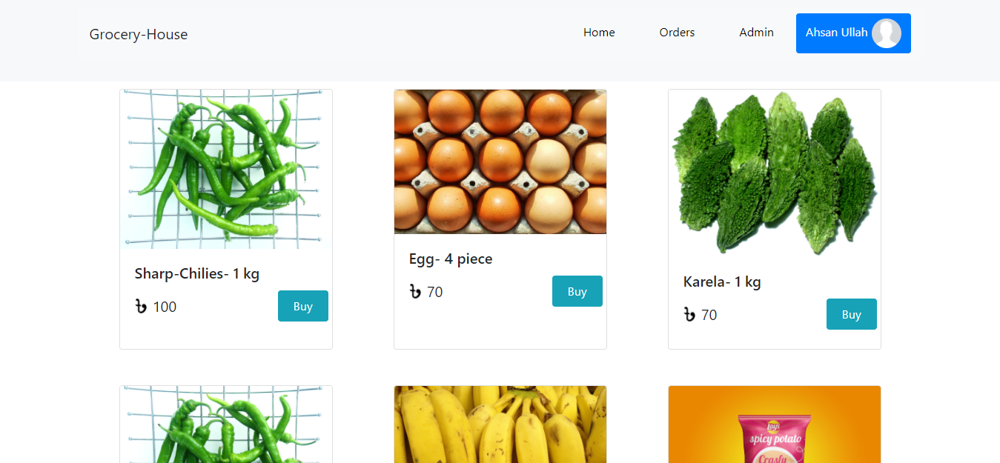

# Grocery House

> This is Grocery House project .

---

### Header:

- [Description](#description)
- [How To Use](#how-to-use)

---

## Description

You can buy your daily products from my website🥰🥰!!
Some features of my project:
1.This site is responsive for mobile and Desktop.
2.In home page you will see many products.  
3.Here I am use some npm package for style.
4.You will see a admin page.which is private page.You can't see without login.And you can add some products.
5.If you order products, you can see your order list in orders page.
6.Here I am create login page by firebase authentication.

---

## How To Use

If you want download this project you can download zip file or clone this site.
After download you open the project in your IDE and open your terminal. Then for run this project you type in your terminal "yarn start".

---

## Live link:

-live server: - [Grocery-House](https://ah-grocery-house.web.app)
